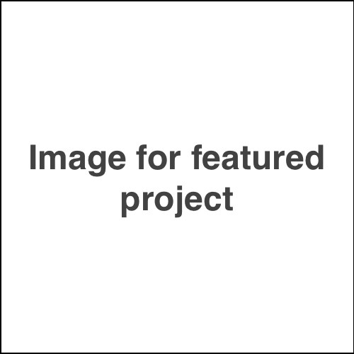
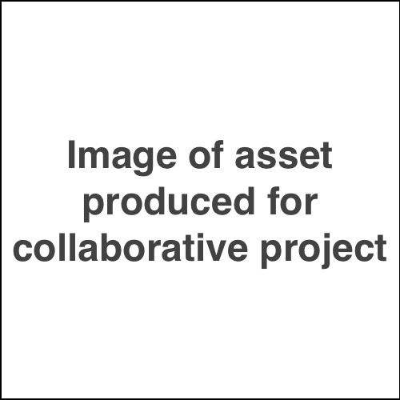

# IASC 2P02 | Alex Christie

**Note to students. DO NOT simply fill in the text here with your own words. Read the assignment sheet carefully and make sure you are doing everything it asks for.**

## Bio

I am a second year student in the IASC program at Brock University. My research area is text analysis, and my research program involves doing x and y things with text analysis tools. This research focus is reflected in my projects in this portoflio, such as project a that looks at b. Similarly, project c looks at d. I'd like to continue with this work in the future by doing x.

## Featured Project: [Title of project here]

Here are 250 words introducing this work.

Here is my 250-word statement describing how this research evolved over time. I made these changes, which you can see [here](). I also made these changes, which you can see [here](). I also made these changes, which you can see [here](). Overall these changes show x and y changes in my thinking.

Read [Title goes here](blog)

## Collaborative Project

Here is my 100-word project description.

Here is my 250-word collaboration statement. I approach collaboration in x ways, which is reflected in y work (available [here]()). I also approach collaboration in a ways, which is reflected in b work (available [here]()). I also contributed x assets to my team, seen below.

## Research Presentation

[Title goes here](reveal/index.html)

## Academic Blog

[Title goes here](blog)
